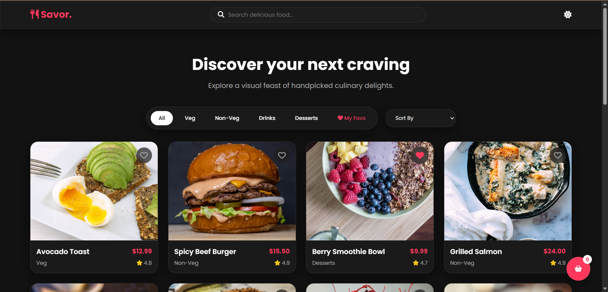
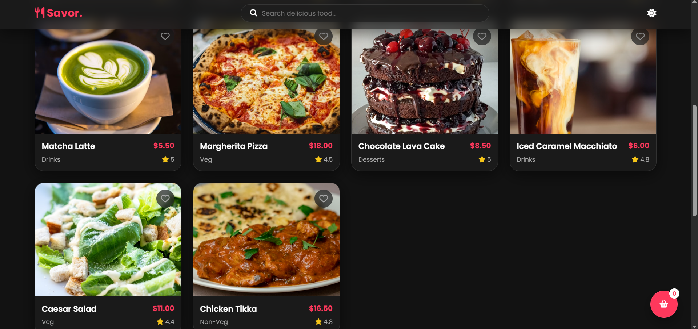
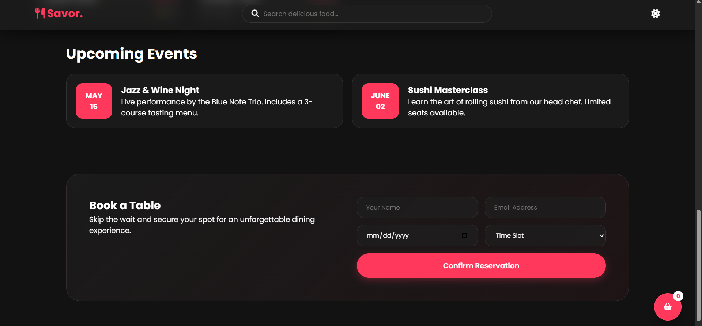
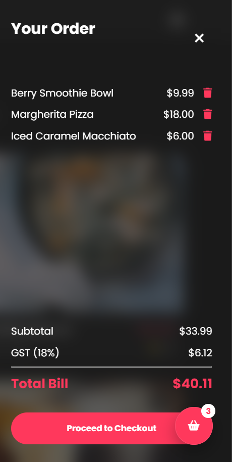
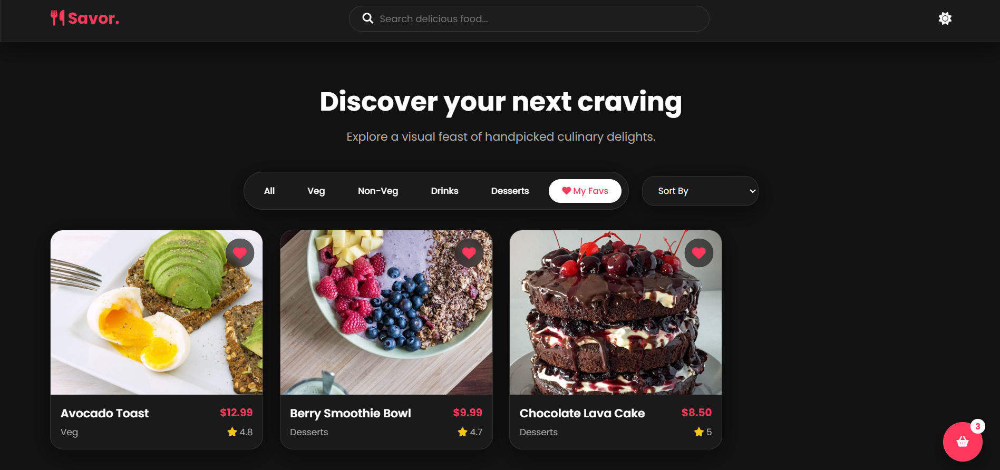

# 🍽️ Savor - Food Discovery Platform

A modern, visually stunning food discovery web application with a glassmorphic design, built using vanilla HTML, CSS, and JavaScript.


## ✨ Features

### 🎨 Design & UI
- **Glassmorphism Design**: Beautiful frosted glass effects throughout the interface
- **Dark/Light Theme**: Toggle between light and dark modes with persistent preference
- **Responsive Layout**: Fully responsive masonry grid that adapts to all screen sizes
- **Smooth Animations**: Elegant transitions, hover effects, and loading states
- **Skeleton Loaders**: Professional loading experience while content loads

### 🍕 Food Discovery
- **Dynamic Food Grid**: Masonry layout showcasing diverse food items
- **Advanced Filtering**: Filter by categories (All, Veg, Non-Veg, Drinks, Desserts, Favorites)
- **Smart Search**: Real-time search functionality across all dishes
- **Sorting Options**: Sort by price (low-to-high, high-to-low) or rating
- **Favorites System**: Save your favorite dishes with heart icon (persists in localStorage)

### 🛒 Shopping Experience
- **Shopping Cart**: Floating cart button with item counter
- **Cart Sidebar**: Slide-out panel showing added items
- **Bill Breakdown**: Subtotal, GST (18%), and total calculation
- **Cart Management**: Add/remove items with instant updates
- **Toast Notifications**: User-friendly feedback for all actions

### 📅 Additional Features
- **Events Section**: Display upcoming food-related events
- **Table Reservations**: Interactive booking form with validation
- **Modal Details**: Click any dish for expanded view with full details
- **Lazy Loading**: Optimized image loading for better performance

---
## 🖼️ Website Preview



---



---



---



---



---

## 🚀 Quick Start

### Prerequisites
- A modern web browser (Chrome, Firefox, Safari, Edge)
- A local server (optional, for development)

### Installation

1. **Clone or Download** the repository:
```bash
git clone https://github.com/yourusername/savor.git
cd savor
```

2. **File Structure**:
```
savor/
│
├── index.html          # Main HTML file
├── style.css           # All styles and theme variables
├── script.js           # JavaScript logic and interactions
├── Savor..png          # Favicon (add your own)
├── README.md           # Documentation
└──previewimages        # screenshots of website
```
## 📖 Usage Guide

### Theme Toggle
Click the moon/sun icon in the navigation bar to switch between light and dark themes. Your preference is automatically saved.

### Browsing Food Items
- Browse the masonry grid of food items
- Hover over cards to see the "View Details" button
- Click anywhere on a card to open the modal with full details

### Filtering & Sorting
1. **Filter by Category**: Click category buttons (All, Veg, Non-Veg, Drinks, Desserts)
2. **View Favorites**: Click the "My Favs" button to see only favorited items
3. **Sort**: Use the dropdown to sort by price or rating
4. **Search**: Type in the search bar for real-time filtering

### Managing Favorites
- Click the heart icon on any food card to add/remove from favorites
- Heart icon fills in when item is favorited
- Access all favorites quickly via the "My Favs" filter

### Shopping Cart
1. Click "Order Now" in the modal to add items to cart
2. Click the floating cart button (bottom-right) to view your cart
3. Review items, see bill breakdown with GST
4. Remove items using the trash icon
5. Click "Proceed to Checkout" when ready

### Making Reservations
1. Scroll to the "Book a Table" section
2. Fill in your name, email, date, and preferred time slot
3. Click "Confirm Reservation"
4. Receive confirmation toast notification


## 🛠️ Technical Stack

- **HTML5**: Semantic markup and structure
- **CSS3**: Custom properties, flexbox, grid, animations
- **Vanilla JavaScript**: ES6+ features, no frameworks
- **Font Awesome 6.4**: Icon library
- **Google Fonts**: Poppins font family
- **Unsplash**: Sample food images (replace with your own)

## 🐛 Known Issues & Limitations

- Cart data is not persistent (resets on page reload)
- Reservation form doesn't connect to a backend
- No actual payment processing
- Images loaded from external URLs (Unsplash)

## 🔮 Future Enhancements

- [ ] Backend integration for real reservations
- [ ] User authentication and profiles
- [ ] Persistent cart with localStorage
- [ ] Payment gateway integration
- [ ] Restaurant location map
- [ ] Review and rating system
- [ ] Filter by dietary restrictions (vegan, gluten-free, etc.)
- [ ] Progressive Web App (PWA) support
- [ ] Multi-language support

## 🤝 Contributing

Contributions are welcome! Feel free to:
1. Fork the repository
2. Create a feature branch (`git checkout -b feature/AmazingFeature`)
3. Commit your changes (`git commit -m 'Add some AmazingFeature'`)
4. Push to the branch (`git push origin feature/AmazingFeature`)
5. Open a Pull Request

## 👨‍💻 Author

**Divyanshi Dikshit**

**Made with ❤️ and lots of ☕**

*Discover your next craving with Savor!*
